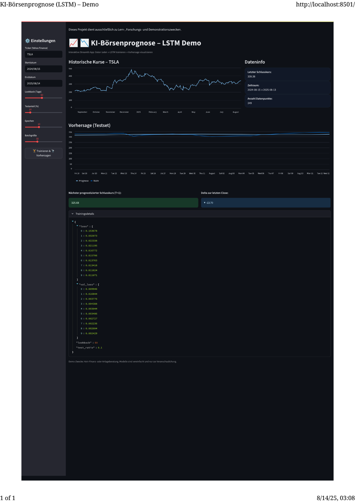

# KI-Börsenprognose – LSTM Demo (Streamlit)
[](https://lstm-ai-predictor.streamlit.app)


Interaktive App: Kursdaten von Yahoo Finance laden -> LSTM (TensorFlow) trainieren -> Vorhersage und Metriken anzeigen.  
Nur zu Lern-, Forschungs- und Demonstrationszwecken – keine Anlageberatung.




Autor: Danut Matinca · E-Mail: <danut.matinca@yahoo.com>

---

## Was macht dieses Programm?
Diese App lädt historische Schlusskurse eines Tickers (z. B. AAPL) mit yfinance, skaliert die Werte und trainiert ein LSTM-Netz zur Ein-Schritt-Vorhersage (T+1).  
Du stellst in der Sidebar Ticker, Zeitraum, Lookback, Testanteil, Epochen und Batchgröße ein und startest per Button "Trainieren & Vorhersagen".

### Funktionen
- Daten laden (yfinance, auto_adjust=True) und bereinigen
- Skalierung mit MinMaxScaler(0..1)
- Sequenzen aus Lookback-Fenstern erstellen
- LSTM-Modell: 64-Units -> Dropout -> 32-Units -> Dense(1), loss='mse', optimizer='adam'
- EarlyStopping auf val_loss (patience=3)
- Vorhersagen für Testset + nächster Schlusskurs (T+1)
- Visualisierung: wahr vs. prognostiziert; Delta zum letzten Close
- Trainingsdetails (Loss/ValLoss) im Expander
- Fehlerbehandlung bei leeren Daten

### Kurz zu LSTM
Long Short-Term Memory (LSTM) ist eine rekurrente Netzarchitektur, die mittels Gates (Input/Forget/Output) Langzeitabhängigkeiten in Sequenzen lernen kann.  
Die Demo nutzt ein Sliding Window der letzten N Schlusskurse (Lookback) als Eingabe und schätzt daraus den nächsten Close-Preis (Single-Feature-Forecast auf Basis des Close-Preises).

---

## Installation und Start

### Linux / macOS
```bash
# 1) Virtuelles Environment
python3.11 -m venv .venv
source .venv/bin/activate

# 2) Abhängigkeiten
pip install --upgrade pip
pip install -r requirements.txt

# 3) Start
streamlit run app.py
```

### Windows (PowerShell)
```powershell
# 1) Virtuelles Environment
py -3.11 -m venv .venv
.\.venv\Scripts\Activate.ps1

# 2) Abhängigkeiten
pip install --upgrade pip
pip install -r requirements.txt

# 3) Start
streamlit run app.py
```

Hinweis: Alternativ die Skripte verwenden (siehe unten).

---

## Projektstruktur
```text
streamlit_lstm_app/
├── app.py
├── README.md
├── LICENSE
├── requirements.txt
├── .gitignore
├── TREE.md
├── run_app.sh
├── setup_env.sh
├── run_app.ps1
├── setup_env.ps1
└── .github/
    └── workflows/
        └── ci.yml
```

---

## Skripte (Erklärung)
- **setup_env.sh** (Linux/macOS): Erzeugt .venv (Python 3.11), aktiviert es und installiert alle Abhängigkeiten aus requirements.txt.
- **run_app.sh** (Linux/macOS): Aktiviert .venv (führt bei Bedarf vorher setup_env.sh aus) und startet die App mit "streamlit run app.py".
- **setup_env.ps1** (Windows/PowerShell): Entspricht setup_env.sh für Windows. Legt .venv mit Python 3.11 an und installiert Requirements.
- **run_app.ps1** (Windows/PowerShell): Entspricht run_app.sh für Windows. Aktiviert .venv und startet die App.

Tipp: Nach dem Setup reicht künftig "./run_app.sh" bzw. ".\run_app.ps1".

---

## Warum ist der Ordner lokal groß?
Hauptsächlich wegen des virtuellen Environments (.venv/) und großer Binärpakete (z. B. TensorFlow).  
Das wird nicht eingecheckt – .gitignore schließt .venv/ aus. Auf GitHub bleibt das Repo klein.

---

## Sprachen-Anteile im Repo
Auf GitHub automatisch via "GitHub Linguist" (Farbbalken oben).  
Lokal messen:
```bash
sudo apt install -y cloc
cloc .
```

---

## Lizenz
MIT – siehe LICENSE. Außerdem ein deutschsprachiger Haftungsausschluss in der Lizenzdatei.
